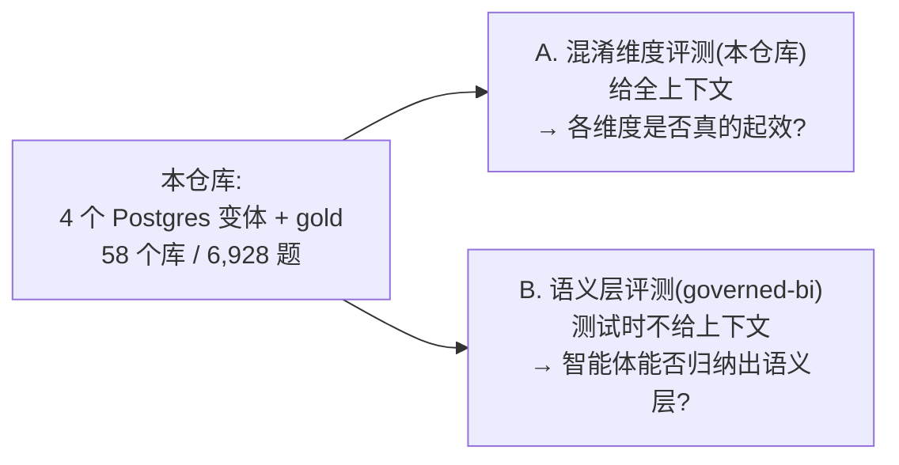

[English](README.md) · **中文**

# BIRD 混淆

> 对 [BIRD](https://bird-bench.github.io/) Text-to-SQL 基准的一次清洗、抗污染、对抗性重建 ——
> 作为**语义层**智能体评测的底料而构建,而非用于单轮 Text-to-SQL。


[](https://huggingface.co/datasets/minhaozhang/BIRD_Obfuscation)
[](https://github.com/Minhao-Zhang/governed-bi)
[](https://creativecommons.org/licenses/by-sa/4.0/)

**58 个数据库 · 6,928 对题目/SQL · 5,539 train / 1,389 test · 4 种混淆变体**

## 本项目解决的三个问题

| 问题 | 做法 |
| --- | --- |
| **污染。** BIRD 把题目、gold SQL 和 schema 名称一并公开,前沿模型的分数可能来自*见过这个基准*。 | schema 标识符被重命名为五种语言之一;题目做保持 SQL 不变的改写。每个面都是可独立开关的维度。 |
| **gold SQL 错误。** BIRD 自身的标注存在大量且*系统性*的错误 —— 已发表的审计给出 49–61% 的错误率,上游此后也已修正或撤回其中相当一部分。 | 通过与官方的 `bird_sql_dev_20251106` 和 `bird23-train-filtered` release 对齐,移除了 2,739 个问题;随后剔除 11 个题量不足的数据库并重新划分。每个问题的溯源信息随 `gold_quality_flags.jsonl` 一并发布。 |
| **没有可供探测的对抗物。** 靠*执行查询*来探索数据库的智能体,在原版 BIRD 里遇不到任何陷阱。 | 1,486 个被污染的"邪恶双胞胎"列和 162 个克隆表,以看似合理的同义词命名,存放真实数据的细微错误副本。严格增量,因此基准真值任务可证明地保持完整。 |

问题过滤是这个数据集的**一项特性**,而不是一条免责声明:gold 质量对下面的任务是承重的 ——
语料中一对错误的(问题, SQL)不是浪费一行,而是教会模型一个会传播的错误映射。完整证据、方法与
引用见 [gold-quality-audit.md](docs/reference/gold-quality-audit-zh.md)。

## 两种评测 —— 请勿混为一谈



### A. 混淆维度评测 —— *在本仓库*

这是一次**数据集验证**检查,而非最终结论。模型拿到的东西与原版 BIRD 任务给的一样 —— 题目、
完整的精简 DDL,以及可选的证据提示 —— 然后被要求一次性写出 SQL。它唯一的目的,是确认每个混淆
维度确实可测量地改变了行为,且表现符合设计。

五个实验臂(`base` / `rename` / `decoy` / `paraphrase` / `all`)外加一项四条件污染研究,以逐题
配对、McNemar 检验、bootstrap 置信区间,以及 14 个数据库的恒等重命名噪声下限来解读。设计与结果见
[evaluation.md](docs/methodology/evaluation-zh.md) §8–§9。

> `evaluation.md` 中测得的数字早于 gold 质量清理,**已过时**。它们作为"当时跑了什么"的记录被
> 保留,而非改写。重新计算方式:把已保存的逐题评分按 `question_id` 与 `gold_quality_flags.jsonl`
> 连接后过滤。

### B. 语义层评测 —— *下游,在 [governed-bi](https://github.com/Minhao-Zhang/governed-bi)*

这才是数据集存在的目的,而且它**与 BIRD 是不同的任务**。

- 智能体拿到 **train** 划分 —— 某个 schema 上的(问题, SQL)对 —— 必须从中归纳出一个可复用的
  语义层:混淆后的标识符*意味着什么*、哪些表如何连接、哪些列能回答哪类问题。
- 测试时,它要在**同一个 schema 上回答未见过的问题,而不会被提供那份映射**。它知道什么,取决于
  它自己建成了什么。

由此产生三条塑造该数据集的推论:

- **每个 schema 的题量接近自变量**,而不是干扰参数 —— 你能归纳出多少语义层,取决于此前有多少
  题目。保留的 58 个 schema 语料规模跨 60–383;报告任何逐 schema 结果时请一并给出规模。
- **语料的 gold 质量是承重的**,这正是清理在这里比在逐题基准里更重要的原因。BIRD 的错误在同一个
  数据库内*一致地*反复出现,恰好是归纳型学习者会当作规则吸收的规律。
- **划分边界不能泄漏。** 语料中一条与测试题近重复的问题,会让智能体用检索代替归纳。目前尚未量化
  —— 见 [gold-quality-audit.md §6](docs/reference/gold-quality-audit-zh.md)。

governed-bi 运行一个真正的"执行并观察"型智能体(LangGraph),报告执行准确率、`routing_recall`
以及 `decoy_touch_rate` —— 智能体的 SQL 有多少时候引用了被污染的诱饵而不是真实的那一列。最后
这个指标正是陷阱存在的理由。

## 四个数据库变体

| 实例 | 端口 | 标识符 | 陷阱 | 维度 |
| --- | --- | --- | --- | --- |
| `pg_base` | 5432 | 原始英文 | — | 对照 |
| `pg_rename` | 5433 | 重命名(5 种语言) | — | 重命名 |
| `pg_decoy` | 5434 | 原始英文 | 已污染 | 诱饵 |
| `pg_rename_decoy` | 5435 | 重命名 | 已污染 | 重命名 + 诱饵 |

真实的行、列、表在**四个实例间逐字节相同** —— 陷阱只会*增加*内容。这正是双预言完整性保证得以
成立的原因:对每一条保留的问题,混淆后的 gold 与已校验的原始 gold 保持执行等价(相对 SQLite 的
R0==R1,跨实例的 R1==R2)。

转储文件中有 **69** 个 schema,而评测只覆盖 **58** 个;被清理剔除的 11 个仍作为未被引用的干扰项
留在其中。这会改变 `routing_recall` 的分母,因此请说明你采用哪种理解 ——
见 [using-the-dataset.md](docs/reference/using-the-dataset-zh.md)。

## 获取数据集

两个存放位置:**数据库**在 Hugging Face(≈12 GB,过大无法入 git),**gold SQL 与清单**受 git
跟踪,位于 [`eval_dataset/`](eval_dataset/)。

```bash
hf download minhaozhang/BIRD_Obfuscation --repo-type dataset --local-dir bird_obf_dumps
docker compose --profile decoy up -d
docker compose cp bird_obf_dumps/pg_base.dump pg_base:/tmp/pg_base.dump
docker compose exec pg_base pg_restore -U bird -d bird --no-owner -j 4 /tmp/pg_base.dump
```

每个实例重复一次 —— 在笔记本上**最多同时开两个**(否则 OOM)。完整的恢复与评测步骤见
[using-the-dataset.md](docs/reference/using-the-dataset-zh.md)。评测脚本优先读 `artifacts/`,
回退到 `eval_dataset/`,因此全新克隆无需重新生成即可运行;DSN 可通过 `PG_*_DSN` 环境变量指向
远端 Postgres。

## 构建方式

十个编号步骤把原始 BIRD SQLite 变成四个实例;每一步读取上一步的输出。操作细节与不变量见
[AGENTS.md](AGENTS.md)。

| # | 步骤 | 产出 |
| --- | --- | --- |
| 1–3 | 按库 80/20 划分 · 分配 schema 语言 · LLM 重命名映射 | `schema_rename_map.json` |
| 4–5 | 用 pgloader 载入 `pg_base` · 把 gold 转译到 Postgres 并校验 R0==R1 | `pg_base` |
| 6–7 | 克隆卷并原地重命名 · 改写 gold 并校验 R1==R2 | `pg_rename`、`{train,test}_final.jsonl` |
| 9–10 | 改写题目 · 注入被污染的陷阱 | `pg_decoy`、`pg_rename_decoy` |
| — | 标记并移除 gold 已被上游取代的问题 · 重新划分 | `gold_quality_flags.jsonl`、`evaluated_dbs.json` |

步骤 8(结构化诱饵)已被取代:经对线上实例核验,其产物并不存在于已发布的转储中。所有脚本用
`uv run python pipeline/<script>.py` 运行。

## 目录结构

| 路径 | 内容 |
| --- | --- |
| [`pipeline/`](pipeline/) | 编号流水线、gold 质量与重新划分脚本、评测框架、共享辅助模块 |
| [`eval_dataset/`](eval_dataset/) | 受 git 跟踪的交付物:gold 配对、重命名映射、陷阱清单、改写、质量标记 |
| [`artifacts/`](artifacts/) | 流水线工作输出(受跟踪的子集:重命名映射、陷阱计划/清单、数据库列表) |
| [`exports/`](exports/) | 逐次运行的(题目, gold, 生成 SQL, 判定)bundle —— 已过时的那次运行,作为证据保留 |
| [`docs/`](docs/) | 方法论(为什么)与参考(怎么做) |

## 文档

| 文档 | 内容 |
| --- | --- |
| [gold-quality-audit.md](docs/reference/gold-quality-audit-zh.md) | BIRD 的标注错误、清理、重新划分,以及仍待定的事项 |
| [dataset.md](docs/methodology/dataset-zh.md) | schema 数据湖、纳入标准、train/test 划分 |
| [obfuscation.md](docs/methodology/obfuscation-zh.md) | 混淆设计与物理实现 |
| [evaluation.md](docs/methodology/evaluation-zh.md) | 完整性检查、污染差值、消融 |
| [corrupted-decoys-design.md](docs/reference/corrupted-decoys-design-zh.md) | 陷阱设计、风险登记册、竣工参数 |
| [limitations.md](docs/reference/limitations-zh.md) | 范围注意事项 —— 引用任何数字前请先读 |
| [using-the-dataset.md](docs/reference/using-the-dataset-zh.md) | 下载、恢复、运行 |
| [pipeline-invariants.md](docs/reference/pipeline-invariants-zh.md) | 修改流水线时需要保持的规则 |
| [AGENTS.md](AGENTS.md) | 面向编码智能体的操作指南 |

## 范围

本仓库负责**准备并验证**数据集。它不修改真实数据,不评测 schema 路由(在评测 A 中正确的数据库
是预先给出的),也不声称封堵了所有污染路径 —— 被记住的字面量和高层 SQL 模板依然存在。

## Python

一律使用 `uv`;`.venv` 由 uv 管理,请勿手动激活,也不要用裸 `python`/`pip`。

```bash
uv run python pipeline/<script>.py
```

## 许可

[CC BY-SA 4.0](https://creativecommons.org/licenses/by-sa/4.0/) —— 可自由共享与改编,需署名并以
相同许可分发。本项目是 [BIRD 基准](https://bird-bench.github.io/)的衍生作品;使用本数据集时请
注明 BIRD 为上游来源。
