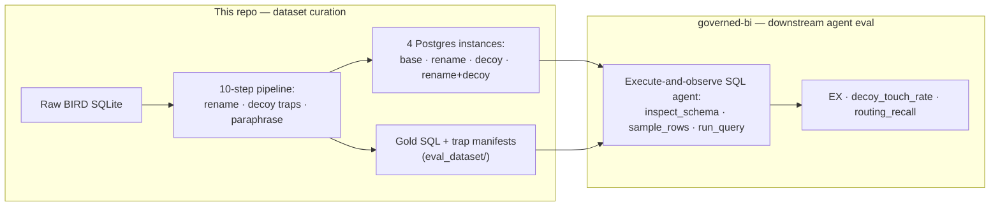

**English** · [中文](README-zh.md)

# BIRD Obfuscation

> A contamination-resistant, adversarial rebuild of the [BIRD](https://bird-bench.github.io/)
> Text-to-SQL benchmark — curated as an evaluation dataset for execute-and-observe SQL agents.
> Schema identifiers are renamed, corrupted "decoy" traps are injected, and questions are
> paraphrased, with gold answers auto-verified across four parallel database versions.


[](https://huggingface.co/datasets/minhaozhang/BIRD_Obfuscation)
[](https://github.com/Minhao-Zhang/governed-bi)
[](https://creativecommons.org/licenses/by-sa/4.0/)

Public benchmarks like BIRD ship their questions, gold SQL, and schema names in the open, so a
frontier model can score partly from *having seen the benchmark* rather than from reasoning over
the schema in front of it — and an agent that explores a database by running queries has nothing
adversarial to navigate. This project rebuilds BIRD into an evaluation dataset that **(a)** strips
the memorisable surface (renamed identifiers, paraphrased questions) and **(b)** actively fights
back against schema-probing agents (corrupted "decoy" columns and cloned tables), while keeping the
SQL task **provably intact**. The dataset is the substrate for a separate downstream agent —
[**governed-bi**](https://github.com/Minhao-Zhang/governed-bi) — which is scored on how often it
grounds in the real schema instead of taking the bait.



## At a glance

| | |
| --- | --- |
| **Problem** | Frontier models may inflate Text-to-SQL scores from memorised BIRD identifiers, and a schema-probing agent has nothing adversarial to navigate. |
| **Deliverable** | A 69-database multilingual PostgreSQL Text-to-SQL corpus (10,164 execution-validated question/SQL pairs) in four obfuscation variants, published on Hugging Face and purpose-built as an agent-evaluation substrate. |
| **Downstream eval** | Consumed by [governed-bi](https://github.com/Minhao-Zhang/governed-bi), an execute-and-observe SQL agent scored on execution accuracy and `decoy_touch_rate` (trap avoidance). |
| **Integrity** | Gold answers stay execution-equivalent across all four DB versions (R0==R1, R1==R2); every trap is strictly *additive*, so real rows, columns, and tables are never modified. |
| **Status** | Dataset complete and published; a dataset-validation run is in (Claude Opus 4.8, test split); the downstream agent scale-run is underway in governed-bi. |

## The downstream evaluation: [governed-bi](https://github.com/Minhao-Zhang/governed-bi)

This repository *curates the dataset*; the agent it was built to stress lives in a separate repo,
[**governed-bi**](https://github.com/Minhao-Zhang/governed-bi). governed-bi runs a real
*execute-and-observe* SQL agent (LangGraph + LangChain) that inspects the schema, samples rows,
runs queries, and refines on what it observes — exactly the threat model the decoy traps target. It
consumes this dataset directly: the [`eval_dataset/`](eval_dataset/) gold, the trap manifests, and
the `pg_rename_decoy` instance. Among the metrics it reports:

- **`decoy_touch_rate`** — how often the agent's SQL references a corrupted decoy column instead of
  the real one. This is the trap-fire signal the decoys exist to produce, measured with
  schema-level guardrails disabled so it reflects the agent's own grounding rather than a filter.
- **Execution accuracy (EX)** and **routing recall** — task success, and whether the agent found
  the right tables in a pooled 69-schema lake.

The three repositories are one system:

> **curate an adversarial eval dataset (here)** → **evaluate an agent against it
> ([governed-bi](https://github.com/Minhao-Zhang/governed-bi))** → **serve it through a UI
> ([governed-bi-ui](https://github.com/Minhao-Zhang/governed-bi-ui))**

The downstream 69-database scale run is in progress; see
[governed-bi](https://github.com/Minhao-Zhang/governed-bi) for current agent results. Everything
below documents the dataset and the validation run that confirms the obfuscation behaves as
designed.

---

## The problem: benchmark contamination

A model evaluated on the public BIRD corpus can benefit from having encountered its schema
identifiers (`movie_release_year`, `user_subscriber`), question phrasings, or SQL fragments
during training. A headline score then conflates two very different things: **schema reasoning**
and **benchmark recall**. This project attacks the recall channel while preserving a
semantically equivalent SQL task, then measures the gap.

The design targets three independent contamination surfaces:

- **Schema identifiers.** Table and column names renamed into one of five languages (English,
  French, German, Spanish, Mandarin Pinyin).
- **Schema probing.** *Corrupted decoy traps*: additive "evil-twin" columns and cloned tables
  that hold subtly corrupted copies of real data under plausible synonym names, meant to
  mislead an agent that explores the schema by *executing* queries.
- **Question phrasing.** SQL-preserving paraphrases of each natural-language question.

Each surface is a separate, independently-toggleable dimension, so the eval can attribute the
accuracy drop to a *mechanism* rather than to a single blurred "obfuscation" knob.

## What this produces

- **A validated multilingual Postgres Text-to-SQL corpus.** 69 databases; **10,164 of 10,541**
  candidate questions pass end-to-end execution validation (8,134 train / 2,030 test, every
  database represented in both). See [docs/methodology/dataset.md §7](docs/methodology/dataset.md).
- **Obfuscated gold SQL and evidence hints**, rewritten to the renamed identifiers.
- **Four PostgreSQL instances** covering the obfuscation combinations: `pg_base` (original),
  `pg_rename` (renamed), `pg_decoy` (traps), and `pg_rename_decoy` (renamed plus traps),
  published as compressed dumps on [Hugging Face](https://huggingface.co/datasets/minhaozhang/BIRD_Obfuscation).
- **Corrupted decoy traps**: 1,486 evil-twin columns plus 162 cloned tables of corrupted data
  ([design and risk register](docs/reference/corrupted-decoys-design.md)).
- **A two-oracle integrity guarantee.** Obfuscated SQL stays execution-equivalent to the
  validated original SQL (R0==R1 against SQLite ground truth, R1==R2 across instances). This
  holds because every trap is strictly *additive*: real rows, columns, and tables are never modified.
- **The evaluation harness**: a four-condition contamination-delta study and a five-arm
  ablation (`base` / `rename` / `decoy` / `paraphrase` / `all`).

## Evaluation design

The evaluation asks one question: **how much of a model's BIRD accuracy survives when the
memorisable surface is removed?** It is built to answer that credibly rather than to just
produce a number:

- **Paired conditions.** Every arm runs the same test set through the same model in the same run;
  deltas are per-question paired against `base`. The **ablation** deltas are read with **McNemar
  tests and bootstrap CIs** ([§9.4](docs/methodology/evaluation.md)); the contamination deltas are
  reported as point estimates (paired CIs pending — see [PROGRESS.md](docs/PROGRESS.md)).
- **An empirical null, not zero.** 14 databases keep an identity (English→English) rename, so
  their rename delta is guaranteed ≈0 by construction. They are the **noise-floor control**,
  and the rename effect is reported *per-language* rather than as a single pooled number that the
  control would dilute ([limitations §1](docs/reference/limitations.md)).
- **Strict *and* lenient scoring.** EX is reported under a BIRD-style type-lenient comparator
  *and* a strict one (no cross-type collapse, case-sensitive). The leniency cancels in the deltas,
  and the strict column is quoted for any absolute-accuracy claim ([limitations §2](docs/reference/limitations.md)).
- **Ablation by mechanism.** `rename−base` isolates identifier recall, `decoy−base` isolates
  robustness to schema-probing traps, and `paraphrase−base` isolates question-form recall.
  `all−base` then measures the combined effect. Design: [evaluation.md §9](docs/methodology/evaluation.md).

### Dataset validation — does the obfuscation actually change model behaviour?

Before handing the dataset to an agent, one frontier model was run **one-shot** over the 2,030-question
test set to confirm the obfuscation measurably shifts behaviour, and that each dimension behaves as
designed. This is a validation check on the dataset, not the headline finding — that is the agent
evaluation in [governed-bi](https://github.com/Minhao-Zhang/governed-bi).

Run: **Claude Opus 4.8, one-shot, test split.** **EX** is execution accuracy (percent of questions
answered correctly); **Δ is the difference between two EX values** — e.g. 51.6% → 46.9% is a 4.8%
drop. Numbers below are lenient EX; full tables (strict EX, per-language, bootstrap CIs) are in
[evaluation.md §8](docs/methodology/evaluation.md) (contamination) and
[§9.4](docs/methodology/evaluation.md) (ablation).

**Contamination — what does renaming schema identifiers cost?** (four conditions)

| Schema | No hint | With hint |
| --- | --- | --- |
| Original (base) | 51.6% | 58.8% |
| Renamed | 46.9% | 57.0% |
| **Δ (rename cost)** | **4.8%** | 1.8% |

**Ablation — each obfuscation mechanism isolated** (no hint, vs the `base` arm at 51.1% EX)

| Arm | EX | Δ vs base |
| --- | --- | --- |
| base | 51.1% | — |
| rename | 47.0% | −4.1% (p<0.001) |
| decoy | 48.9% | −2.2% (p=0.001) |
| paraphrase | 54.6% | **+3.5%** (p<0.001) |
| all | 45.3% | −5.8% (p<0.001) |

- **Rename** removes a small but real identifier-recall advantage (4.8% no-hint), and the
  ablation replicates it (−4.1%). It is near-zero on the English control (identity rename) and
  largest on Pinyin (+10.5% no-hint), so the effect scales with distance from English. Note this
  per-language gradient is partly confounded with raw task difficulty for an English-centric
  model; separating the two needs an English→English synonym control ([limitations §1](docs/reference/limitations.md)).
- **Decoy traps** cost only 2.2% in this one-shot setting — but this arm sees the decoys only as
  extra column *names* in the DDL; the interactive trap-firing they were designed for is measured
  downstream in [governed-bi](https://github.com/Minhao-Zhang/governed-bi) (`decoy_touch_rate`).
- **Paraphrase is positive (+3.5%)** — an honest negative result for the question-form-recall
  hypothesis: the SQL-preserving paraphrases tidy up ambiguous phrasing rather than expose
  memorised wording.
- **All combined** is the largest drop (−5.8%), lowest on Pinyin.

Pipeline integrity (R0==R1, R1==R2) over 10,164 questions holds. Per-question (question, gold SQL,
generated SQL, correctness) records for this run are in [`exports/`](exports/).

## Project status

**The dataset is finished and published; a dataset-validation run (Claude Opus 4.8, test split) is
graded and reported here, and the downstream agent evaluation is built in
[governed-bi](https://github.com/Minhao-Zhang/governed-bi). Remaining measurement work is the train
split and wider model coverage.**

| Component | State |
| --- | --- |
| Core pipeline (steps 0-7): split → rename map → load → transpile → rename → validate | ✅ complete & validated |
| Extended obfuscation (decoy traps, paraphrases) | ✅ built & applied |
| Four PostgreSQL instances + git-tracked eval artifacts | ✅ published (HF and [`eval_dataset/`](eval_dataset/)) |
| Contamination-delta eval harness | ✅ implemented; ✅ first results (Claude Opus 4.8, test split) |
| Five-arm ablation harness | ✅ implemented; ✅ first results (same run) |
| Interactive execute-and-observe agent that exercises the traps | ✅ built in [governed-bi](https://github.com/Minhao-Zhang/governed-bi) (downstream repo) |

Full history, decisions, and what's next: [PROGRESS.md](docs/PROGRESS.md).

### Scope boundaries

- This repo **prepares and validates** the dataset; the downstream *agent* evaluation
  (execute-and-observe, schema routing) lives in
  [governed-bi](https://github.com/Minhao-Zhang/governed-bi). In the validation run here, the
  correct database is supplied upfront in all conditions.
- It does **not modify real data**. Clean instances are untouched, and decoy instances only *add*
  corrupted columns and tables, so R1==R2 holds.
- It does **not** claim to remove every contamination path (memorised literals or high-level SQL
  templates remain); it targets the identifier, schema-probing, and question-phrasing surfaces.

## What this project demonstrates

For anyone reviewing this as an engineering sample, the transferable pieces are:

- **Dataset curation for agent evaluation.** A benchmark designed backwards from the agent it
  will stress: the corrupted decoys exist to produce a measurable `decoy_touch_rate` in
  [governed-bi](https://github.com/Minhao-Zhang/governed-bi), not as decoration.
- **Eval design under contamination.** Controlled conditions, an empirical null, per-mechanism
  ablation, and paired significance testing instead of raw leaderboard numbers.
- **Adversarial data design.** Decoy traps built specifically against execute-and-observe
  agents while provably preserving the ground-truth task ([design doc](docs/reference/corrupted-decoys-design.md)).
- **Correct data infrastructure.** A SQLite-to-PostgreSQL migration with an execution-equivalence
  guarantee and a documented set of [pipeline invariants](docs/reference/pipeline-invariants.md)
  (pgloader DDL bugs, an AST-mutation infinite loop, unbounded result sets, connection-latency traps).
- **Honest scoping.** A standalone [limitations doc](docs/reference/limitations.md) written before
  any effectiveness claim is published.

## How it works

A 10-step pipeline turns raw BIRD SQLite into the four validated PostgreSQL instances. Each step
reads the previous step's output; operational detail and invariants live in [AGENTS.md](AGENTS.md).

### Pipeline steps

| # | Step | Output |
| --- | --- | --- |
| 1 | Split (per-DB 80/20, seeded) | `artifacts/{train,test}.jsonl` |
| 2 | Assign a schema language per DB | `artifacts/db_language_map.json` |
| 3 | Generate the rename map (LLM translation) | `artifacts/schema_rename_map.json` |
| 4 | Load `pg_base` via pgloader | `pg_base` (5432) |
| 5 | Transpile gold SQL to Postgres + validate R0==R1 | `workdir/*_transpiled.jsonl` |
| 6 | Clone `pg_base` volume, rename identifiers in place | `pg_rename` (5433) |
| 7 | Rename SQL + validate R1==R2 → **deliverable** | `artifacts/{train,test}_final.jsonl` |
| 8-9 | Structural decoys (superseded) + question paraphrases | `artifacts/question_paraphrases.jsonl` |
| 10 | Inject corrupted decoy traps | `pg_decoy` (5434), `pg_rename_decoy` (5435) |

Run with `uv run python pipeline/<script>.py` from the repo root, after `docker compose up -d`.
Two evaluation entrypoints, `pipeline/eval_contamination.py` and `pipeline/eval_ablation.py`, sit
downstream of the numbered steps. They default to an offline prepare → API-only
generation → database grading workflow; pass `--local` only for the legacy
same-machine run.

### Repository layout

| Path | What's in it |
| --- | --- |
| [`pipeline/`](pipeline/) | The numbered pipeline (`00`-`10`), the eval harnesses (`eval_contamination.py`, `eval_ablation.py`, `probe_schema_recall.py`), and shared helpers (`_db.py`, `_traps.py`, `_corruption.py`, …) |
| [`eval_dataset/`](eval_dataset/) | Git-tracked deliverable: validated gold question/SQL pairs, rename map, trap manifests, paraphrases |
| [`exports/`](exports/) | Per-run (question, gold SQL, generated SQL, correctness) tables, shipped as a compressed bundle |
| [`artifacts/`](artifacts/) | Pipeline working outputs (git-tracked subset: rename map, retained DBs, trap plans/manifests) |
| [`docs/methodology/`](docs/methodology/) | Why each design decision was made (dataset, obfuscation, evaluation) |
| [`docs/reference/`](docs/reference/) | Operational detail: pipeline invariants, decoy-trap design, limitations, dataset usage |
| [`data/`](data/README.md) | Raw BIRD source (not tracked; download instructions in `data/README.md`) |

## Get the dataset

The deliverable ships in two homes:

- **Databases.** Four PostgreSQL dumps (base / rename / decoy / rename+decoy) on Hugging Face:
  [minhaozhang/BIRD_Obfuscation](https://huggingface.co/datasets/minhaozhang/BIRD_Obfuscation) (too large for git).
- **Gold SQL, rename map, and trap manifests.** Git-tracked in [`eval_dataset/`](eval_dataset/).

```bash
# 1. get the database dumps (~12 GB, four PostgreSQL instances)
hf download minhaozhang/BIRD_Obfuscation --repo-type dataset --local-dir bird_obf_dumps

# 2. bring up the empty instances and restore each dump into its match
docker compose --profile decoy up -d
docker compose cp   bird_obf_dumps/pg_base.dump pg_base:/tmp/pg_base.dump
docker compose exec pg_base pg_restore -U bird -d bird --no-owner -j 4 /tmp/pg_base.dump
#   ...repeat for pg_rename / pg_decoy / pg_rename_decoy (two at a time on a laptop; see OOM note)

# 3. prepare one arm's public API bundle and private grading manifest
uv run python pipeline/eval_ablation.py --arms base --prepare-only
```

Full download, restore, and local-eval instructions: [docs/reference/using-the-dataset.md](docs/reference/using-the-dataset.md).
Eval scripts read `artifacts/` and fall back to `eval_dataset/`, so a fresh clone runs with no
regeneration; Postgres DSNs are env-configurable (`PG_*_DSN`) to target remote Postgres / RDS.

## Documentation

| Doc | What it covers |
| --- | --- |
| [docs/methodology/dataset.md](docs/methodology/dataset.md) | Schema-lake construction, inclusion criteria, train/test split |
| [docs/methodology/obfuscation.md](docs/methodology/obfuscation.md) | Obfuscation design, decisions, physical realisation; decoy-trap + paraphrase dimensions (§7-§11) |
| [docs/methodology/evaluation.md](docs/methodology/evaluation.md) | Integrity check, contamination delta, ablation (§9) |
| [docs/reference/corrupted-decoys-design.md](docs/reference/corrupted-decoys-design.md) | Decoy-trap design, risk register, as-built parameters |
| [docs/reference/limitations.md](docs/reference/limitations.md) | Known limitations and scope caveats; read before citing any number |
| [docs/reference/using-the-dataset.md](docs/reference/using-the-dataset.md) | Download, restore, and run the eval |
| [docs/reference/pipeline-invariants.md](docs/reference/pipeline-invariants.md) | Rules to preserve when editing the pipeline, with rationale |
| [docs/eda-report.md](docs/eda-report.md) | Exploratory analysis of the BIRD corpus |
| [AGENTS.md](AGENTS.md) | How to run and extend the pipeline (operational) |
| [PROGRESS.md](docs/PROGRESS.md) | History, status snapshot, and what's next |

## Corpus facts

- **Combined corpus**: 80 SQLite databases, 10,962 questions (BIRD train + dev pooled).
- **After exclusions**: 69 databases, 10,541 questions (11 databases with < 60 questions excluded).
- **Split**: random 80/20 holdout within each database, seeded; no difficulty stratification
  (BIRD train questions carry no difficulty labels).

The `data/` directory holds the raw BIRD dataset (not in version control). See
[data/README.md](data/README.md) for download instructions.

## Python

Always use `uv`:

```bash
uv run python pipeline/<script>.py
uv pip install <package>
```

Dependencies are declared in [`pyproject.toml`](pyproject.toml) (with a pinned pip fallback in
[`requirements.txt`](requirements.txt)); the `.venv` directory is managed by `uv` — do not activate
it manually or use bare `python`/`pip`.

## License

This work is licensed under a
[Creative Commons Attribution-ShareAlike 4.0 International License (CC BY-SA 4.0)](https://creativecommons.org/licenses/by-sa/4.0/).

You are free to share and adapt the material for any purpose, provided you give appropriate
credit and distribute your contributions under the same license.

This project is a derivative of the [BIRD benchmark](https://bird-bench.github.io/); please
credit BIRD as the upstream source when using this dataset.
