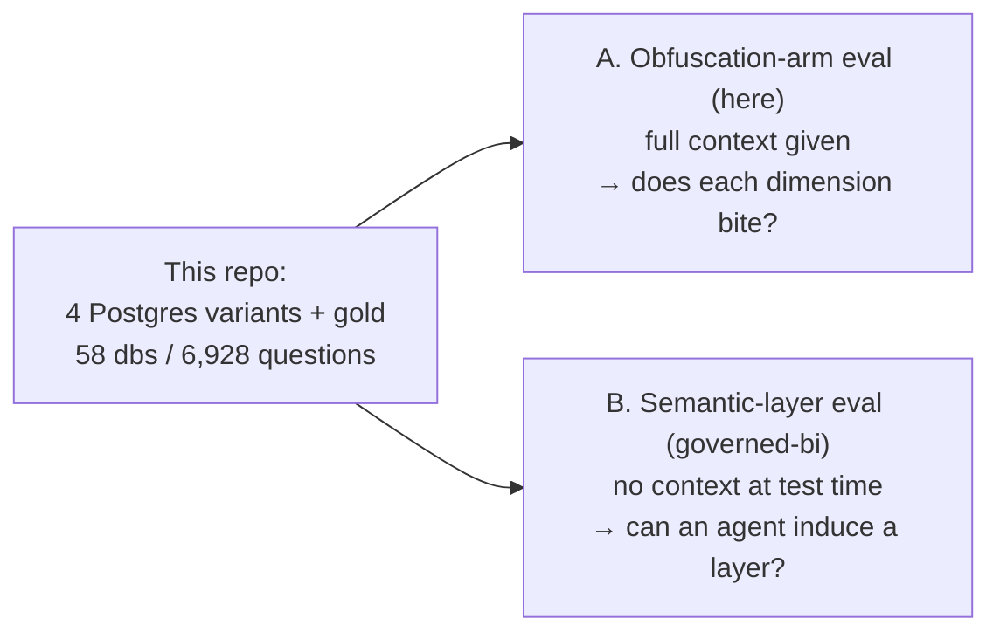

**English** · [中文](README-zh.md)

# BIRD Obfuscation

> A cleaned, contamination-resistant, adversarial rebuild of the
> [BIRD](https://bird-bench.github.io/) Text-to-SQL benchmark — curated as the substrate for a
> **semantic-layer** agent evaluation, not for one-shot Text-to-SQL.


[](https://huggingface.co/datasets/minhaozhang/BIRD_Obfuscation)
[](https://github.com/Minhao-Zhang/governed-bi)
[](https://creativecommons.org/licenses/by-sa/4.0/)

**58 databases · 6,928 question/SQL pairs · 5,539 train / 1,389 test · 4 obfuscation variants**

## Three problems this fixes

| Problem | What was done |
| --- | --- |
| **Contamination.** BIRD ships questions, gold SQL, and schema names in the open, so a frontier model can score from *having seen the benchmark*. | Schema identifiers renamed into one of five languages; questions paraphrased SQL-preservingly. Each surface is an independently-toggleable dimension. |
| **Wrong gold SQL.** BIRD's own annotations are substantially and *systematically* mis-annotated — published audits report 49–61% error rates, and upstream has since corrected or withdrawn much of it. | 2,739 questions removed by joining against the official `bird_sql_dev_20251106` and `bird23-train-filtered` releases, then 11 under-populated databases dropped and the rest re-split. Provenance for every question is shipped in `gold_quality_flags.jsonl`. |
| **Nothing adversarial to probe.** An agent that explores a database by *running queries* faces no traps in stock BIRD. | 1,486 corrupted "evil-twin" columns and 162 cloned tables holding subtly wrong copies of real data under plausible synonym names. Strictly additive, so the ground-truth task is provably intact. |

Question filtering is a **feature of the dataset**, not a caveat: gold quality is load-bearing for
the task below, because a wrong (question, SQL) pair in the corpus does not waste one row — it
teaches a wrong mapping that propagates. Full evidence, method, and citations:
[gold-quality-audit.md](docs/reference/gold-quality-audit.md).

## Two evaluations — do not conflate them


```mermaid
flowchart LR
    DATA["This repo:<br/>4 Postgres variants + gold<br/>58 dbs / 6,928 questions"]
    DATA --> A["A. Obfuscation-arm eval (here)<br/>full context given<br/>→ does each dimension bite?"]
    DATA --> B["B. Semantic-layer eval (governed-bi)<br/>no context at test time<br/>→ can an agent induce a layer?"]
```

### A. Obfuscation-arm evaluation — *in this repo*

A **dataset-validation** check, not a headline finding. The model is handed everything the original
BIRD task hands it — the question, the full stripped DDL, optionally the evidence hint — and asked
for SQL, one-shot. Its only purpose is to confirm that each obfuscation dimension measurably shifts
behaviour and behaves as designed.

Five arms (`base` / `rename` / `decoy` / `paraphrase` / `all`) plus a four-condition contamination
study, read with per-question pairing, McNemar tests, bootstrap CIs, and a 14-database
identity-rename noise floor. Design and results: [evaluation.md](docs/methodology/evaluation.md)
§8–§9.

> The measured numbers in `evaluation.md` predate the gold-quality purge and are **superseded**.
> They are retained as a record of what was run, not rewritten. Recompute by filtering stored
> per-question grades on `question_id` against `gold_quality_flags.jsonl`.

### B. Semantic-layer evaluation — *downstream, in [governed-bi](https://github.com/Minhao-Zhang/governed-bi)*

This is what the dataset exists for, and it is a **different task from BIRD**.

- The agent gets the **train** split — (question, SQL) pairs over a schema — and must induce a
  reusable semantic layer from them: what the obfuscated identifiers *mean*, which tables join how,
  which columns answer which kind of question.
- At test time it answers **unseen questions over the same schema without being given that
  mapping**. What it knows is what it built.

Three consequences that shape the dataset:

- **Per-schema question count is close to the independent variable**, not a nuisance parameter —
  how much layer you can induce depends on how many prior questions you had. Corpus sizes range
  60–383 across the 58 retained schemas; report them alongside any per-schema result.
- **Corpus gold quality is load-bearing**, which is why the purge matters more here than for a
  per-question benchmark. BIRD's errors recur *consistently* within a database, so they are exactly
  the regularity an inductive learner absorbs as a rule.
- **The split boundary must not leak.** A corpus question that near-duplicates a test question lets
  the agent retrieve instead of induce. Not yet quantified — see
  [gold-quality-audit.md §6](docs/reference/gold-quality-audit.md).

governed-bi runs a real execute-and-observe agent (LangGraph) and reports execution accuracy,
`routing_recall`, and `decoy_touch_rate` — how often the agent's SQL references a corrupted decoy
instead of the real column. That last metric is the reason the traps exist.

## The four database variants

| Instance | Port | Identifiers | Traps | Dimension |
| --- | --- | --- | --- | --- |
| `pg_base` | 5432 | original English | — | control |
| `pg_rename` | 5433 | renamed (5 languages) | — | rename |
| `pg_decoy` | 5434 | original English | corrupted | decoy |
| `pg_rename_decoy` | 5435 | renamed | corrupted | rename + decoy |

Real rows, columns, and tables are **byte-identical across all four** — traps only ever *add*. That
is what makes the two-oracle integrity guarantee hold: obfuscated gold stays execution-equivalent
to the validated original (R0==R1 against SQLite, R1==R2 across instances) for every retained
question.

The dumps carry **69** schemas while the eval covers **58**; the 11 dropped by the purge remain as
unreferenced distractors. That changes the `routing_recall` denominator, so state which reading you
use — [using-the-dataset.md](docs/reference/using-the-dataset.md).

## Get the dataset

Two homes: the **databases** are on Hugging Face (≈12 GB, too large for git), the **gold SQL and
manifests** are git-tracked in [`eval_dataset/`](eval_dataset/).

```bash
hf download minhaozhang/BIRD_Obfuscation --repo-type dataset --local-dir bird_obf_dumps
docker compose --profile decoy up -d
docker compose cp bird_obf_dumps/pg_base.dump pg_base:/tmp/pg_base.dump
docker compose exec pg_base pg_restore -U bird -d bird --no-owner -j 4 /tmp/pg_base.dump
```

Repeat per instance — **at most two hot at once on a laptop** (OOM). Full restore and eval
instructions: [using-the-dataset.md](docs/reference/using-the-dataset.md). Eval scripts read
`artifacts/` and fall back to `eval_dataset/`, so a fresh clone runs with no regeneration; DSNs are
env-configurable (`PG_*_DSN`) for remote Postgres.

## How it is built

Ten numbered steps turn raw BIRD SQLite into the four instances; each reads the previous step's
output. Operational detail and invariants: [AGENTS.md](AGENTS.md).

| # | Step | Output |
| --- | --- | --- |
| 1–3 | Split 80/20 per DB · assign a schema language · LLM rename map | `schema_rename_map.json` |
| 4–5 | Load `pg_base` via pgloader · transpile gold to Postgres, validate R0==R1 | `pg_base` |
| 6–7 | Clone volume, rename in place · rewrite gold, validate R1==R2 | `pg_rename`, `{train,test}_final.jsonl` |
| 9–10 | Paraphrase questions · inject corrupted traps | `pg_decoy`, `pg_rename_decoy` |
| — | Flag and drop questions with superseded BIRD gold · re-split | `gold_quality_flags.jsonl`, `evaluated_dbs.json` |

Step 8 (structural decoys) is superseded: its payload is absent from the published dumps, verified
against the live instance. Run everything with `uv run python pipeline/<script>.py`.

## Layout

| Path | Contents |
| --- | --- |
| [`pipeline/`](pipeline/) | Numbered pipeline, the gold-quality and resplit scripts, eval harnesses, shared helpers |
| [`eval_dataset/`](eval_dataset/) | Git-tracked deliverable: gold pairs, rename map, trap manifests, paraphrases, quality flags |
| [`artifacts/`](artifacts/) | Pipeline working outputs (tracked subset: rename map, trap plans/manifests, db lists) |
| [`exports/`](exports/) | Per-run (question, gold, generated SQL, verdict) bundle — superseded run, retained as evidence |
| [`docs/`](docs/) | Methodology (why) and reference (how) |

## Documentation

| Doc | Covers |
| --- | --- |
| [gold-quality-audit.md](docs/reference/gold-quality-audit.md) | BIRD's annotation errors, the purge, the resplit, what is still open |
| [dataset.md](docs/methodology/dataset.md) | Schema lake, inclusion criteria, train/test split |
| [obfuscation.md](docs/methodology/obfuscation.md) | Obfuscation design and physical realisation |
| [evaluation.md](docs/methodology/evaluation.md) | Integrity checks, contamination delta, ablation |
| [corrupted-decoys-design.md](docs/reference/corrupted-decoys-design.md) | Trap design, risk register, as-built parameters |
| [limitations.md](docs/reference/limitations.md) | Scope caveats — read before citing any number |
| [using-the-dataset.md](docs/reference/using-the-dataset.md) | Download, restore, run |
| [pipeline-invariants.md](docs/reference/pipeline-invariants.md) | Rules to preserve when editing the pipeline |
| [AGENTS.md](AGENTS.md) | Operational guide for coding agents |

## Scope

This repo **prepares and validates** the dataset. It does not modify real data, does not evaluate
schema routing (the correct database is supplied upfront in evaluation A), and does not claim to
close every contamination path — memorised literals and high-level SQL templates remain.

## Python

Always `uv`; the `.venv` is uv-managed, so never activate it or use bare `python`/`pip`.

```bash
uv run python pipeline/<script>.py
```

## License

[CC BY-SA 4.0](https://creativecommons.org/licenses/by-sa/4.0/) — share and adapt with credit,
under the same license. This project is a derivative of the
[BIRD benchmark](https://bird-bench.github.io/); please credit BIRD as the upstream source.
