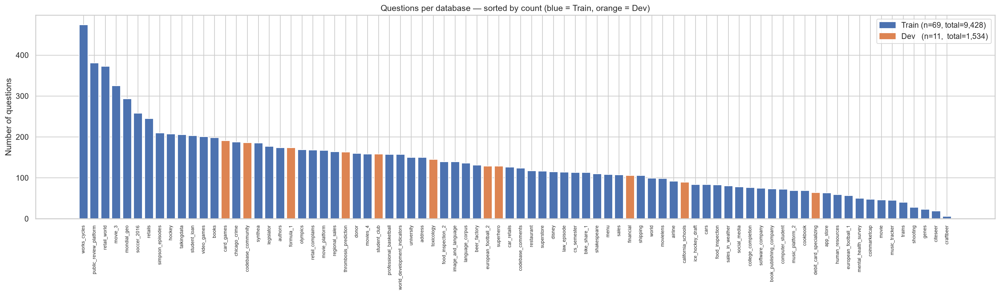
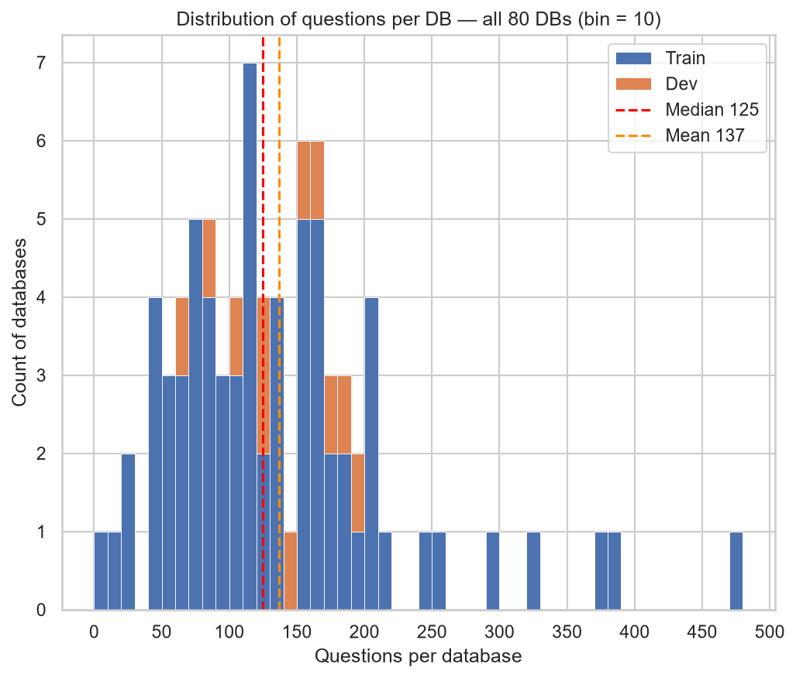
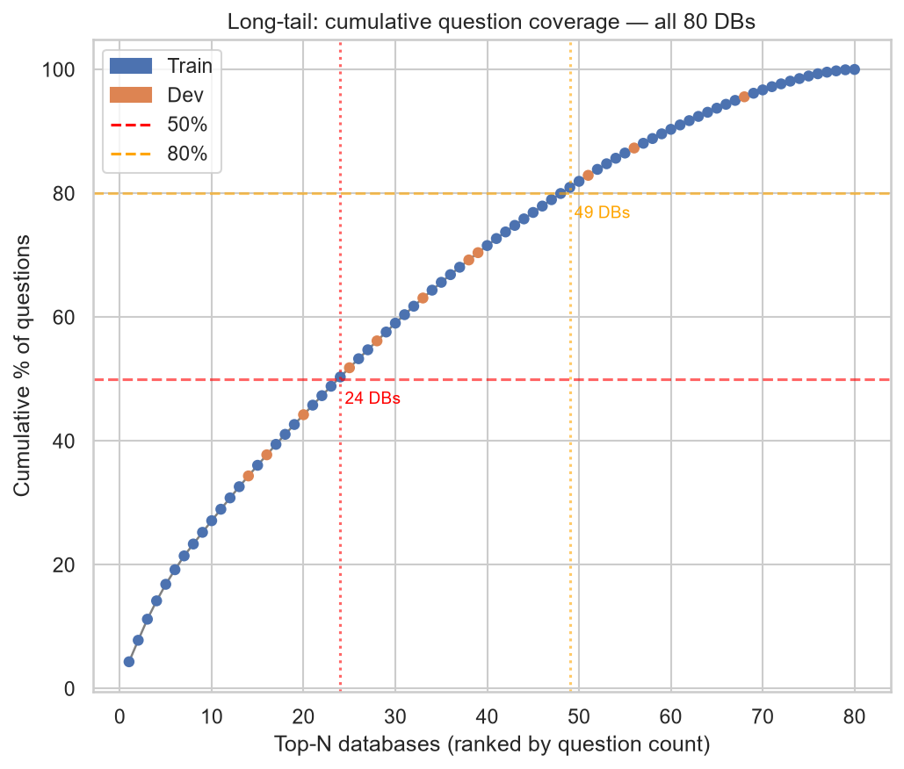
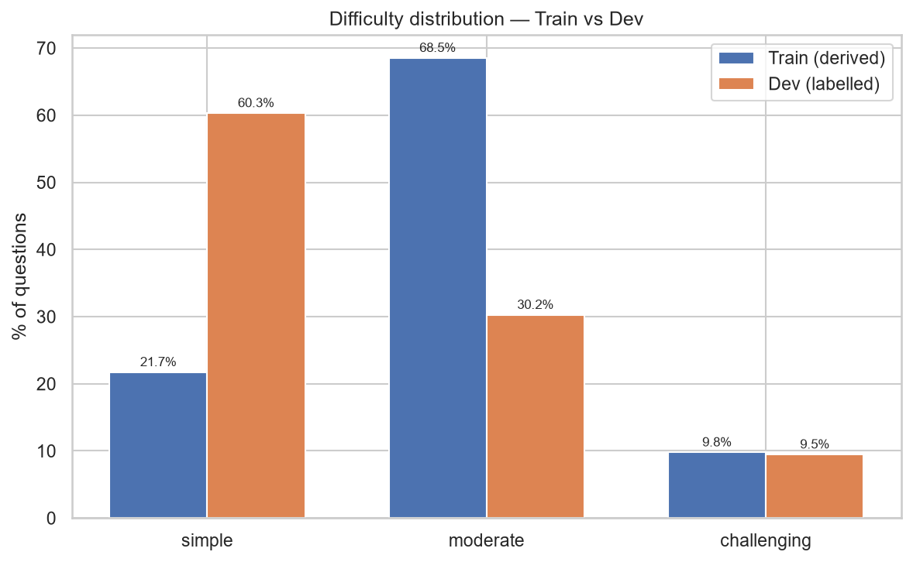
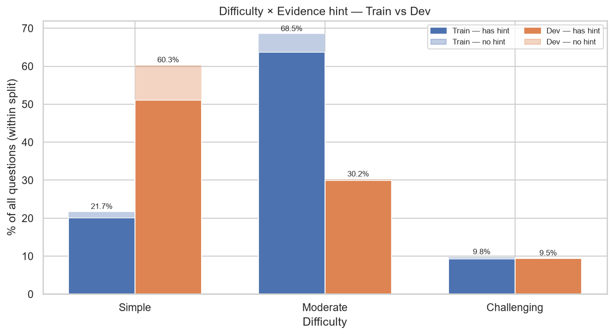
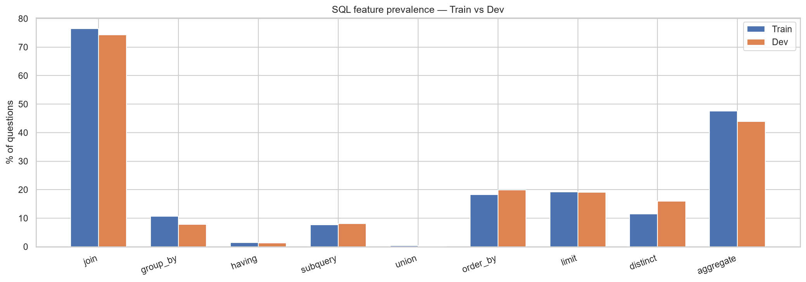
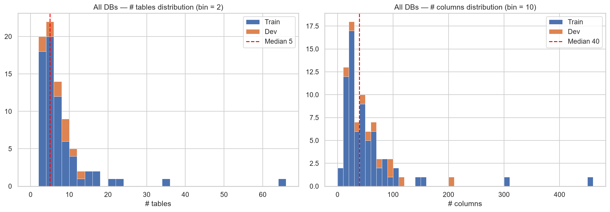
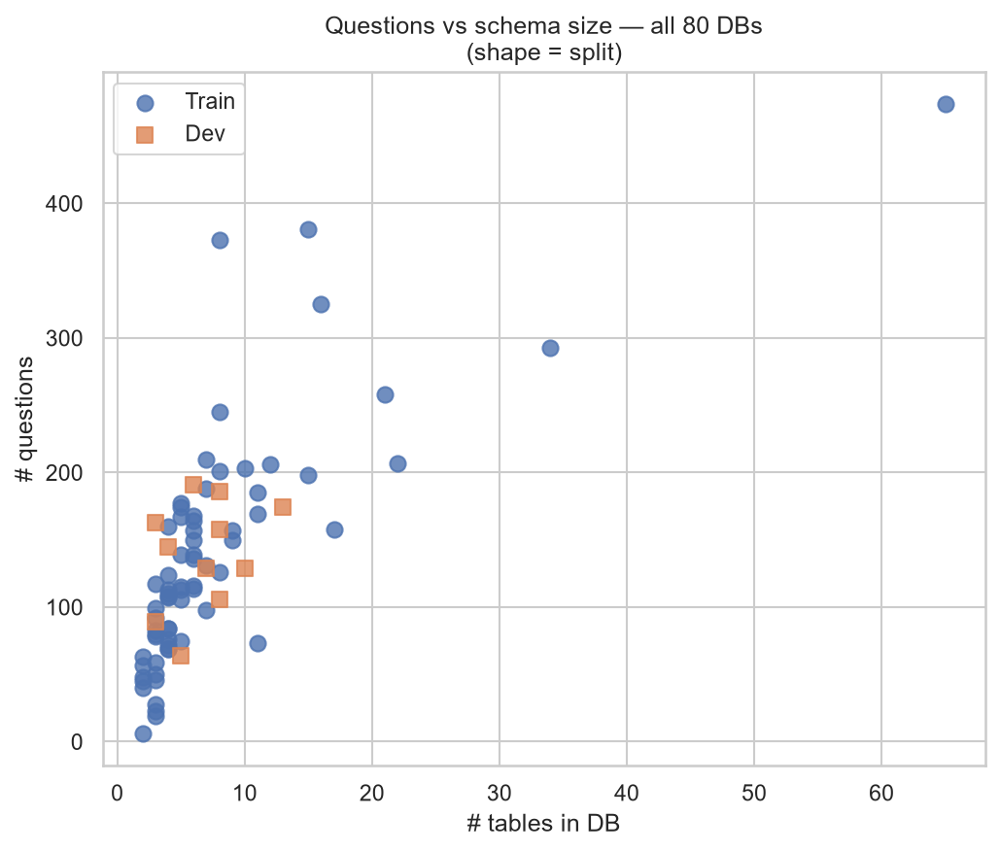
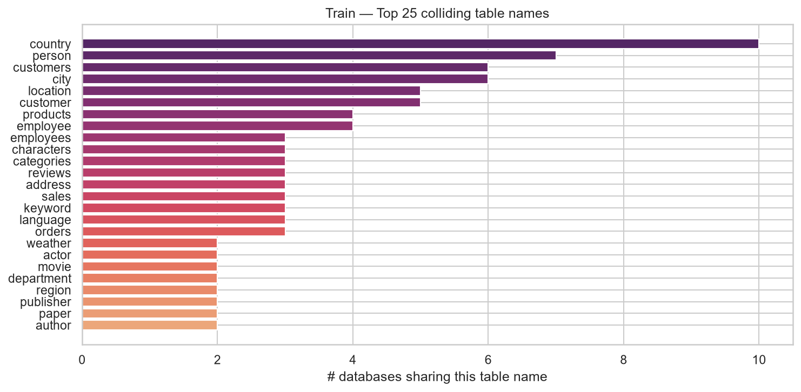
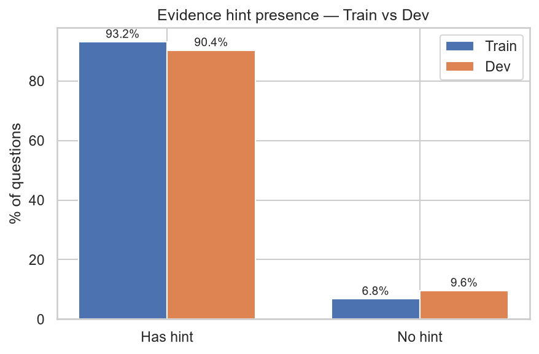

# EDA Report — BIRD Benchmark Dataset

---

## 1. Dataset Overview

| | Train | Dev | Combined |
|---|---|---|---|
| Questions | 9,428 | 1,534 | 10,962 |
| Databases | 69 | 11 | 80 |
| Unique table names | 440 | 75 | 501 |
| Colliding table names | 42 | 0 | 50 |
| Questions with evidence hint | 8,783 (93.2%) | 1,386 (90.4%) | 10,169 (92.8%) |

---

## 2. Questions per Database

| | Train | Dev | Combined |
|---|---|---|---|
| DBs | 69 | 11 | 80 |
| Min questions/DB | 6 | 64 | 6 |
| Max questions/DB | 474 | 191 | 474 |
| Median questions/DB | 116 | 145 | 125 |
| Mean questions/DB | 137 | 139 | 137 |

Right-skewed distribution. Top 24 DBs account for 50% of all questions; top 49 DBs account for 80%.

---

## 3. Difficulty Distribution

Train difficulty is derived from SQL structure (simple = 0 complex keywords; moderate = 1; challenging = 2+).
Dev difficulty is the original BIRD label.

| | Simple | Moderate | Challenging |
|---|---|---|---|
| Train | 2,047 (21.7%) | 6,460 (68.5%) | 921 (9.8%) |
| Dev | 925 (60.3%) | 464 (30.2%) | 145 (9.5%) |
| Combined | 2,972 (27.1%) | 6,924 (63.2%) | 1,066 (9.7%) |

---

## 4. SQL Feature Prevalence

| Feature | Train | Dev | Combined |
|---|---|---|---|
| JOIN | 76.5% | 74.3% | 76.2% |
| Aggregate (COUNT/SUM/AVG/MIN/MAX) | 47.6% | 43.9% | 47.0% |
| ORDER BY | 18.3% | 19.9% | 18.5% |
| LIMIT | 19.2% | 19.1% | 19.2% |
| DISTINCT | 11.4% | 15.9% | 12.1% |
| GROUP BY | 10.7% | 7.8% | 10.3% |
| Subquery | 7.7% | 8.1% | 7.7% |
| HAVING | 1.5% | 1.4% | 1.5% |
| UNION | 0.3% | 0.1% | 0.3% |

Both splits have near-identical feature distributions.

---

## 5. Schema Complexity

| Metric | Train (min/median/max) | Dev (min/median/max) | Combined (min/median/max) |
|---|---|---|---|
| Tables per DB | 2 / 5 / 65 | 3 / 7 / 13 | 2 / 5 / 65 |
| Columns per DB | 7 / 35 / 456 | 12 / 65 / 200 | 7 / 40 / 456 |
| Foreign keys per DB | 0 / 4 / 61 | 1 / 8 / 29 | 0 / 4 / 61 |

No strong correlation between schema size and question count per database.

---

## 6. Table-Name Collisions (Train)

42 table names appear in more than one train database.
Top collisions: `country` (10 DBs), `person` (7 DBs), `city` (6 DBs), `customers` (6 DBs).
The dev set has zero collisions — all 75 table names are unique across its 11 databases.

---

## 7. Evidence Hints

| | Has hint | No hint |
|---|---|---|
| Train | 8,783 (93.2%) | 645 (6.8%) |
| Dev | 1,386 (90.4%) | 148 (9.6%) |
| Combined | 10,169 (92.8%) | 793 (7.2%) |
